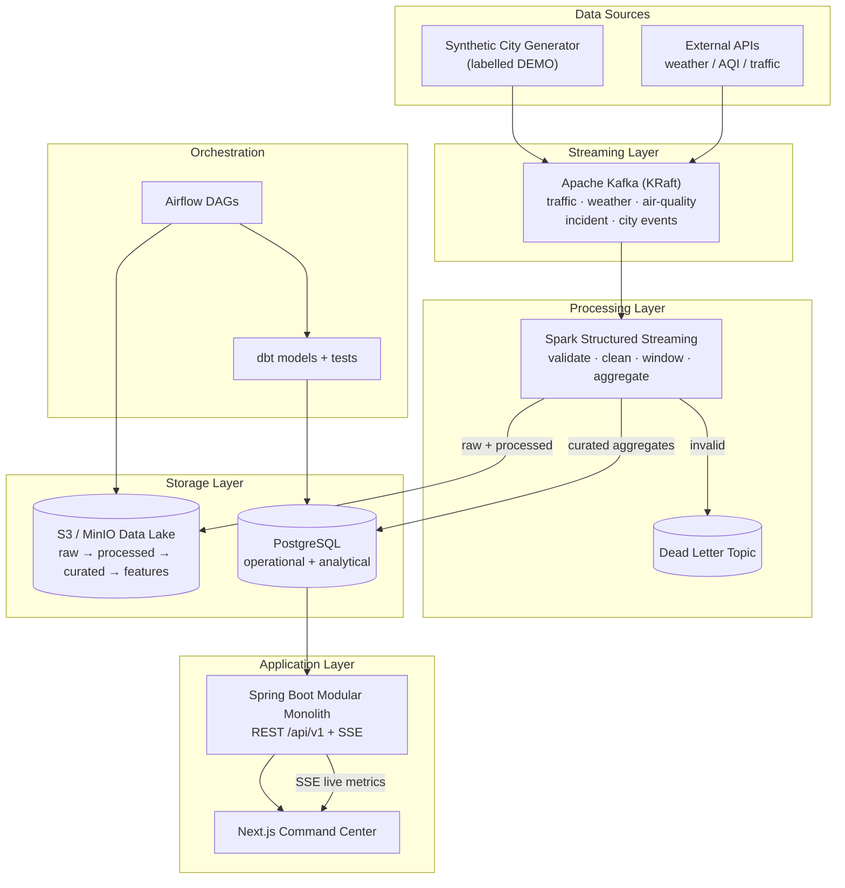
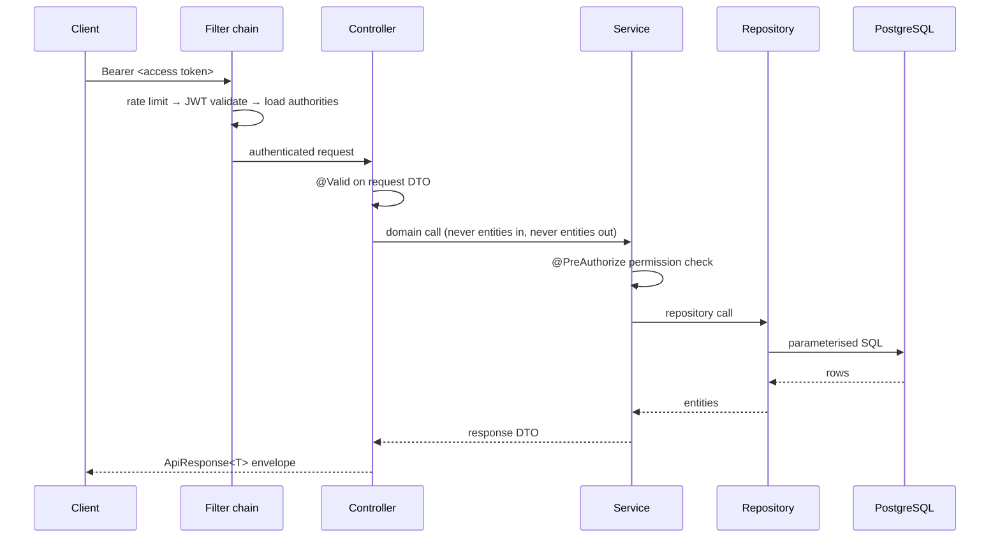
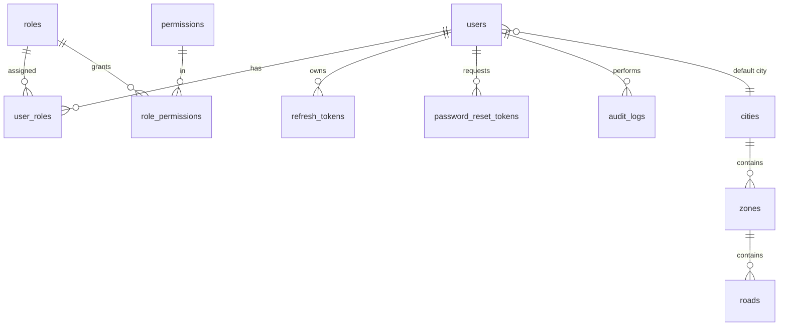
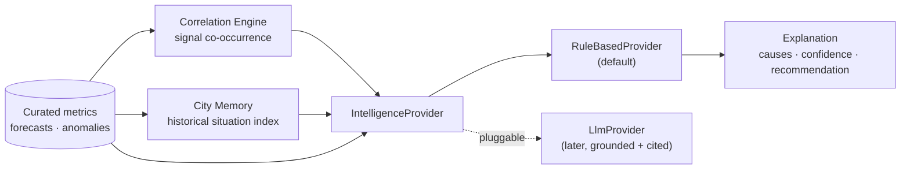
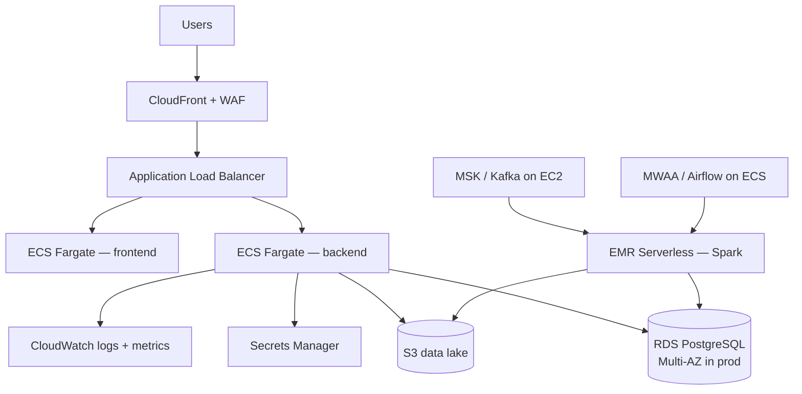

# CityPulse OS — Architecture

> Status: **living document**. Updated at the end of every milestone.
> Source of truth for requirements is the PRD; this document records *how* those
> requirements are implemented and *why* each technology was chosen.

---

## 1. Architectural Principles

1. **Modular monolith first.** The backend is a single deployable Spring Boot
   application internally split into modules with explicit boundaries. Splitting
   into services is deferred until a module has a proven independent scaling or
   ownership need (PRD §39.9–39.11).
2. **The pipeline is the product.** Data flows through real ingestion,
   processing, and storage stages. No UI reads from a hardcoded fixture.
3. **Grounded intelligence.** Every number the UI shows traces back to a row in
   the warehouse. The AI layer explains data it can cite; it never invents facts.
4. **Secure by construction.** Authorization is enforced at the API layer, not
   the frontend. Secrets live in the environment, never in source.
5. **Runnable at every milestone.** `docker compose up` must produce a working
   product after every phase.
6. **Synthetic data is labelled synthetic.** Demo data carries an explicit
   provenance flag end-to-end (PRD §42).

---

## 2. Confirmed Technology Decisions

| Layer | Choice | Reason |
|---|---|---|
| Backend | Java 21 + Spring Boot 3.5 | PRD §26. Java 21 is the only JVM on the dev machine and is an LTS release. |
| Build | Maven + wrapper (`mvnw`) | Reproducible; wrapper pins the Maven version for CI. |
| Persistence | PostgreSQL 17 + Spring Data JPA | PRD §23. PG 17 is already running locally; PG 16+ is available on RDS. |
| Migrations | Flyway | Plain, versioned SQL. Reviewable in PRs; no ORM-generated DDL. |
| Auth | JWT access + opaque rotating refresh token | PRD §7, §30. Access tokens are stateless; refresh tokens are revocable server-side. |
| Frontend | Next.js 15 (App Router) + TypeScript | PRD §31. Server components for shell, client components for live views. |
| Styling | Tailwind CSS v4 + a token layer | Enforces the PRD §32 spacing/typography scale without a heavy component kit. |
| Streaming | Apache Kafka (KRaft mode) | PRD §20. KRaft removes the ZooKeeper dependency. |
| Processing | Apache Spark Structured Streaming (PySpark) | PRD §21. Windowed aggregation + feature generation. |
| Object storage | MinIO locally → Amazon S3 in AWS | S3-compatible API, so one code path for both. |
| Orchestration | Apache Airflow | PRD §25. Batch DAGs only; streaming stays in Spark. |
| Transformation | dbt-postgres | PRD §24. Versioned SQL models with data quality tests. |
| Local env | Docker Compose | Confirmed available. Single-command local stack. |
| Cloud | **AWS** | Confirmed target. See §9. |
| AI layer | Deterministic rules engine behind `IntelligenceProvider` | See §8. |
| Python | **3.12** | PySpark and Airflow do not support 3.14, which is the machine default. |

### Decisions deliberately *not* taken

- **No Kubernetes.** ECS Fargate covers the deployment need at this scale (PRD §34).
- **No microservices.** Nothing yet justifies the operational cost.
- **No 3D digital twin.** PRD §10 explicitly scopes the MVP to a 2D map.
- **No deep-learning forecaster in the MVP.** PRD §15 (execution prompt) requires
  a measured baseline before complexity.

---

## 3. System Architecture



### Why each component earns its place

| Component | Responsibility it *actually* owns | What breaks without it |
|---|---|---|
| Kafka | Decouples ingestion rate from processing rate; replay after a bad deploy | Producer outages lose events; no replay |
| Spark | Windowed aggregation over event-time with late-arrival handling | Per-zone rolling metrics would need hand-rolled state |
| Airflow | Retryable, idempotent, scheduled batch jobs with lineage | Cron with no retry semantics or observability |
| dbt | Versioned analytical models with data quality tests | Untested SQL scattered across services |
| MinIO/S3 | Reproducible raw data; features decoupled from the warehouse | Raw data unrecoverable once transformed |

---

## 4. Backend Architecture

A single Spring Boot application, organised by **feature module**, not by
technical layer. Each module owns its entities, repositories, services, and
controllers, and exposes a narrow public interface to other modules.

```text
com.citypulse
├── CityPulseApplication.java
├── common/            cross-cutting, depends on nothing
│   ├── api/           ApiResponse envelope, ApiError, PageResponse
│   ├── exception/     domain exceptions + GlobalExceptionHandler
│   ├── domain/        BaseEntity (id, timestamps, soft delete)
│   ├── config/        CORS, OpenAPI, Jackson, security headers
│   └── util/          shared helpers
├── security/          authentication mechanics
│   ├── jwt/           token issue / parse / validate
│   ├── filter/        JwtAuthenticationFilter, RateLimitFilter
│   └── config/        SecurityFilterChain, password encoder
├── auth/              signup, login, refresh, logout, password reset
├── user/              users, roles, permissions (RBAC)
├── geo/               cities, zones, roads
├── audit/             security-sensitive action log
└── (later phases)     telemetry · forecast · anomaly · alert
                       simulation · analytics · apikey · intelligence
```

**Dependency rule:** `common` ← `security` ← feature modules. A feature module
never imports another feature module's repository or entity; it goes through
that module's service interface.

### Request flow



**Rules enforced in code review:**
- Controllers contain no business logic; they validate, delegate, and map.
- JPA entities never cross the controller boundary (PRD §26).
- Every endpoint returns the `ApiResponse` envelope (PRD §28).
- Every exception is handled by `GlobalExceptionHandler`; stack traces never
  reach the client.

---

## 5. Database Architecture



Conventions applied to every table:

- `id BIGSERIAL PRIMARY KEY`; external identifiers use a separate `uuid` column
  so internal keys are never exposed in URLs.
- `created_at`, `updated_at` (`TIMESTAMPTZ NOT NULL DEFAULT now()`).
- `deleted_at TIMESTAMPTZ NULL` for soft deletion where records are referenced
  by history (users, cities, zones). Hard delete for tokens.
- Foreign keys always declared, with an explicit `ON DELETE` policy.
- An index for every foreign key and every column used in a `WHERE` filter.
- Partial unique indexes for soft-deleted uniqueness, e.g.
  `UNIQUE (email) WHERE deleted_at IS NULL`.
- Time-series telemetry tables (added in Phase 3) are partitioned by day on
  event time and never receive updates — append only.

---

## 6. Frontend Architecture

```text
frontend/src
├── app/
│   ├── (marketing)/          landing page — public, statically rendered
│   ├── (auth)/               login, signup, forgot/reset password
│   └── (app)/                authenticated shell
│       ├── command-center/
│       ├── live/  forecast/  simulator/  insights/
│       ├── alerts/  analytics/  data-sources/  api-keys/  settings/
├── components/
│   ├── ui/                   primitives: Button, Card, Input, Badge…
│   ├── layout/               Sidebar, Topbar, PageHeader
│   ├── charts/               chart wrappers with shared theming
│   └── map/                  map container + zone overlays
├── lib/
│   ├── api/                  typed fetch client, token refresh, error mapping
│   ├── auth/                 session context, route guards
│   └── format/               units, dates, number formatting
└── styles/                   design tokens
```

**State strategy:** server components fetch initial data; TanStack Query owns
client-side cache and revalidation; a single SSE connection feeds live metrics
into the query cache rather than into component state, so every subscriber
updates consistently.

**Non-negotiable UI states** (PRD §31): every data view implements loading
(skeleton), empty, error (with retry), and success. A view missing one of the
four fails review.

---

## 7. Data Engineering Architecture

### Lake layout

```text
s3://citypulse-{env}-lake/
  raw/        source=traffic/ingest_date=2026-08-03/…   immutable, never rewritten
  processed/  domain=traffic/event_date=2026-08-03/…    validated + typed
  curated/    metric=zone_traffic_5m/event_date=…/…     analytics-ready
  features/   model=traffic_congestion/version=…/…      ML training sets
```

Raw is write-once. Any transformation bug is fixed by reprocessing raw, never by
editing processed data (PRD §22).

### Kafka topics

| Topic | Key | Retention | Purpose |
|---|---|---|---|
| `traffic-events` | `zone_id` | 7d | Per-sensor vehicle counts, speeds |
| `weather-events` | `city_id` | 7d | Observations and short-range forecasts |
| `air-quality-events` | `zone_id` | 7d | AQI and pollutant readings |
| `incident-events` | `zone_id` | 30d | Accidents, closures, obstructions |
| `city-events` | `city_id` | 30d | Scheduled events with attendance |
| `*.dlq` | original key | 30d | Records failing schema or range validation |

Keying by `zone_id` guarantees per-zone ordering, which the windowed
aggregations depend on. Schemas are versioned JSON with a required `schema_version`
field; consumers reject unknown major versions into the DLQ rather than guessing.

### Data quality gates (PRD §13)

Validation runs in Spark *before* the processed layer: null checks on required
fields, coordinate bounds, timestamp sanity (not future, not older than the
retention window), metric range checks, and duplicate suppression on
`(source, external_id)`. Failures route to the DLQ with a reason code and
increment a per-source quality metric. Bad data never reaches curated.

---

## 8. Intelligence Architecture



The MVP ships `RuleBasedProvider`: causes are ranked by measured contribution to
the forecast, confidence comes from the model's evaluated error on a holdout
set, and recommendations are selected from a catalogue keyed by cause and
severity. Every field is derived from a database row, so an explanation can
always be traced to its evidence.

`IntelligenceProvider` is a narrow interface (`explain(SituationContext) →
Explanation`). Adding an LLM later means implementing that interface and
switching a config property. Any future LLM implementation must pass the
retrieved evidence in the prompt and reject output containing figures absent
from the evidence set.

**Forecasting** starts as a seasonal-naive plus gradient-boosted baseline over
lagged and calendar features, evaluated with MAE/MAPE on a temporal holdout.
Measured metrics are published in `docs/ML.md`. No accuracy figure is displayed
in the product that is not produced by an evaluation run (PRD §16 of the
execution prompt).

---

## 9. Cloud Architecture (AWS)

Nothing is provisioned until costs are approved (PRD §26 of the execution prompt).



| Service | Purpose | Cost category | Cheaper alternative in use first |
|---|---|---|---|
| ECS Fargate | Run backend + frontend containers | Low–medium | Single small task per service |
| RDS PostgreSQL | Managed warehouse | Medium | `db.t4g.micro`, single-AZ in dev |
| S3 | Data lake | Very low | Lifecycle rules to IA after 30d |
| Secrets Manager | JWT + DB credentials | Very low | SSM Parameter Store (free tier) |
| CloudWatch | Logs, metrics, alarms | Low | 7-day retention in dev |
| **MSK** | Managed Kafka | **High (~$150+/mo)** | **Kafka KRaft on one `t4g.small` EC2 until scale demands MSK** |
| **EMR Serverless** | Managed Spark | **Medium–high, per-job** | **Spark on the same EC2 host for dev volumes** |

Environments `dev` / `staging` / `prod` are separated by account-level tags and
distinct parameter paths. Deployment is container-based; no SSH access to hosts.

---

## 10. Security Architecture

Detailed in [SECURITY.md](./SECURITY.md). Summary of controls:

| Layer | Control |
|---|---|
| Transport | TLS terminated at CloudFront/ALB; HSTS |
| Authentication | BCrypt (cost 12), short-lived JWT access, rotating refresh with reuse detection |
| Authorization | RBAC with fine-grained permissions, enforced by `@PreAuthorize` on services |
| Input | Bean Validation on every request DTO; request size limits |
| Output | Consistent error envelope; no stack traces or internal identifiers |
| Transport headers | CSP, X-Content-Type-Options, X-Frame-Options, Referrer-Policy |
| Rate limiting | Per-IP on auth endpoints, per-API-key on the public API |
| Data | Parameterised queries only; least-privilege DB role |
| Secrets | Environment variables locally, Secrets Manager in AWS; nothing in git |
| Audit | Append-only log of authentication, role, key, and admin actions |

---

## 11. Observability Architecture

- **Logs** — structured JSON via Logback, one line per request, correlated by a
  `X-Request-Id` propagated through MDC to every log statement and returned to
  the client.
- **Metrics** — Micrometer → Prometheus. API latency histograms, error rate by
  endpoint, DB pool saturation, Kafka consumer lag, pipeline job outcomes.
- **Health** — `/actuator/health` with liveness and readiness groups; readiness
  fails when the database or a critical dependency is unreachable so the load
  balancer stops routing.
- **Dashboards/alerts** — Grafana provisioned from `monitoring/`; alerts on crash
  loops, error rate, consumer lag, DAG failure, and data quality failure rate.

---

## 12. Change Log

| Date | Change |
|---|---|
| 2026-08-03 | Initial architecture. Confirmed: Docker Compose local stack, AWS target, rule-based intelligence with pluggable provider. |
